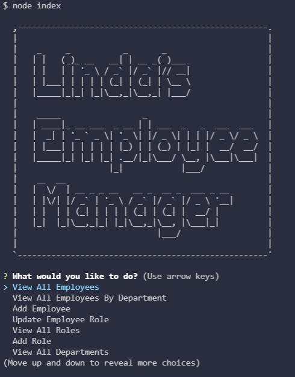
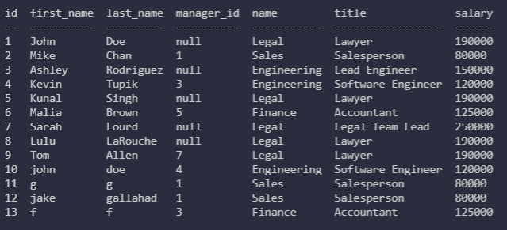

# Rocking-Employee-Mgmt-Sys
## Author
- [@LindaWaterhouse](https://www.github.com/llwaterhouse)

## Description
* Rocking Employee Management System is an app built with node.js, inquirer,etc. that interfaces with mysql. It is command line driven and allows the user to manipulate the data stored in the employees_db database.

* When starting the application, the user is presented with a list of options that are clear and easy to follow.

* The changes that the user makes are reflected in the database.

## Screenshots

### Initial screenshot

### ViewAllEmployees Example

## Built With

* Express
* mysql
* mysql2
* HTML
* CSS
* Javascript
* node.js
* inquirer
* chalk

## Installation Instructions

If you want to edit application you must have a Github account, download Visual Studio Code, install node.js and install Express.

[Create a Github account](https://github.com)

[Download Visual Studio](https://code.visualstudio.com/download/)

[Download node.js](https://nodejs.org/en/download/)

Clone the github project

To install packages dependencies in package.json, open a console in the top level directory and run the following command 

>npm i

## Usage
To run this application, type 

> node index

and follow the prompts

## Deliverables

### Walkthrough Video Link
[Rocking Employee Management app](https://watch.screencastify.com/v/DkkAK96SiyKpON5ybx7k)

### Repository

[GitHub repository for this project](https://github.com/llwaterhouse/Rocking-Employee-Mgmt-Sys)

## Acknowledgements

Rutgers Coding Bootcamp

## License
MIT

[Click here for full license text](LICENSE)
